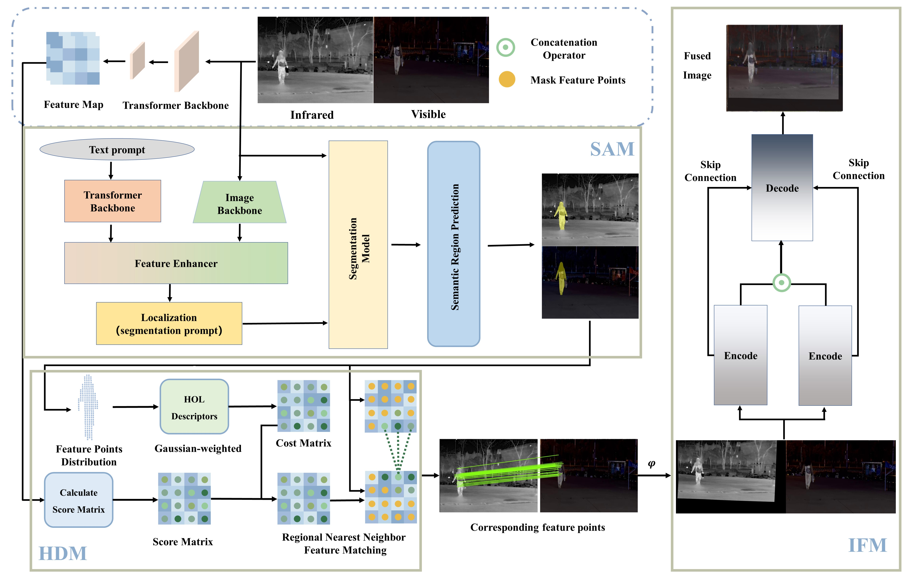

## SA-DNet
SA-DNet is  an end-to-end Semantic-Aware on-Demand registration-fusion network. SA-DNet can specify registration and fusion regions based on semantic information, achieving on-demand conceptualization. Furthermore, the sam, reg, and fuse modules are separated, allowing integration of new functionalities. The current architecture implemented in this project is as follows:

<div style="text-align:center;">
    
</div>

###### Note:
In this project, the HOL operators in reg have not been implemented. When SAM perceives regions that are too large, it leads to excessive computation in HOL, causing the system to freeze.


### TODO
* Fixed bug.
* Update the new sam, reg, and fuse modules.
* To optimize and implement the HOL operator


### Install
#### Download this project:
```shell
git clone git@github.com:Meng-Sang/SA-DNet.git
cd SA-DNet
```
#### Runtime environment
This project requires a runtime environment with `Python=3.8` or higher. Additionally, it depends on the libraries specified in the `requirements.txt` file and 2 GitHub repositories ([Grounding DINO](https://github.com/IDEA-Research/GroundingDINO) and  [Segment Anything](https://github.com/facebookresearch/segment-anything)). The environment configuration is as follows:
##### Step 1: install python and requirements.txt
```shell
conda create -n sa-dnet  python=3.8
pip install -r requirement.txt
```

##### Step 2: Configure [Grounding DINO](https://github.com/IDEA-Research/GroundingDINO)
###### Install [Grounding DINO](https://github.com/IDEA-Research/GroundingDINO)

For Grounding DINO installation, please refer to [Grounding DINO](https://github.com/IDEA-Research/GroundingDINO).

###### Download weight
```shell
# if model/sam/grounding_dino/weight not exist.
# please run: mkdir -p model/sam/grounding_dino/weight
# then:
cd model/sam/grounding_dino/weight
wget https://github.com/IDEA-Research/GroundingDINO/releases/download/v0.1.0-alpha2/groundingdino_swinb_cogcoor.pth
```

###### Note:
If the network is unavailable, the following error may occur:
```shell
OSError: Can't load tokenizer
```


##### Step 3: Configure  [Segment Anything](https://github.com/facebookresearch/segment-anything)
###### Install [Segment Anything](https://github.com/facebookresearch/segment-anything)
```shell
git clone git@github.com:facebookresearch/segment-anything.git
cd segment-anything
pip install -e .
```
or
```shell
pip install git+git://github.com/facebookresearch/segment-anything.git
```
###### Download weight
```shell
# if model/sam/grounding_dino/weight not exist.
# please run: mkdir -p model/sam/segment_anything/weight
# then:
cd model/sam/segment_anything/weight
wget https://dl.fbaipublicfiles.com/segment_anything/sam_vit_h_4b8939.pth
```

### Demo
#### Run with Python

```python
import cv2
from utils.predict import sa_dnet

ir_image = cv2.imread("assets/ir/006393.jpg")
vi_image = cv2.imread("assets/vi/006393.jpg")
_, fuse_image = sa_dnet(ir_image, vi_image, "car", is_mask=True)
cv2.imwrite("assets/demo.jpg", fuse_image)
```
#### Show result
<div style="text-align:center;">
    <table align="center">
  <tr>
    <td align="center">
      
      <br>IR Image
    </td>
    <td align="center">
      
      <br>VI Image
    </td>
  </tr>
  <tr>
    <td align="center" colspan="2">
      
      <br>Matching Image (Car)
    </td>
  </tr>
  <tr>
    <td align="center">
      
      <br>Unmask Fuse Image (Car)
    </td>
    <td align="center">
      
      <br>Mask Fuse Image (Car)
    </td>
  </tr>
</table>
</div>


### Acknowledgments:

This project depends on the following repositories:
* [Grounding DINO](https://github.com/IDEA-Research/GroundingDINO)
* [Segment Anything](https://github.com/facebookresearch/segment-anything)
